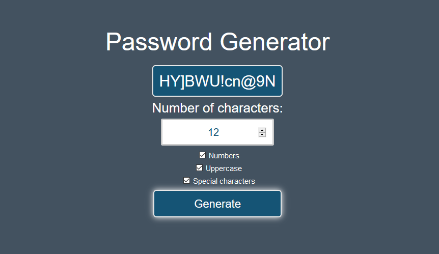

# Password Generator
###### Generate a random password using Javascript

This tool allows you to create a [pseudorandom](https://en.wikipedia.org/wiki/Pseudorandomness) password, with the option to include uppercase letters, numbers, and special characters.

It was created as a beginner Javascript project to learn about working with arrays, conditional logic, and the Math.random() method.

## Possible Improvements:
- 'Copy to Clipboard' button.
- Add feature to include random dictionary password generation. (See [this xkcd comic](https://xkcd.com/936/)).
- Save passwords to file (encrypted), accessible only by using a master password.